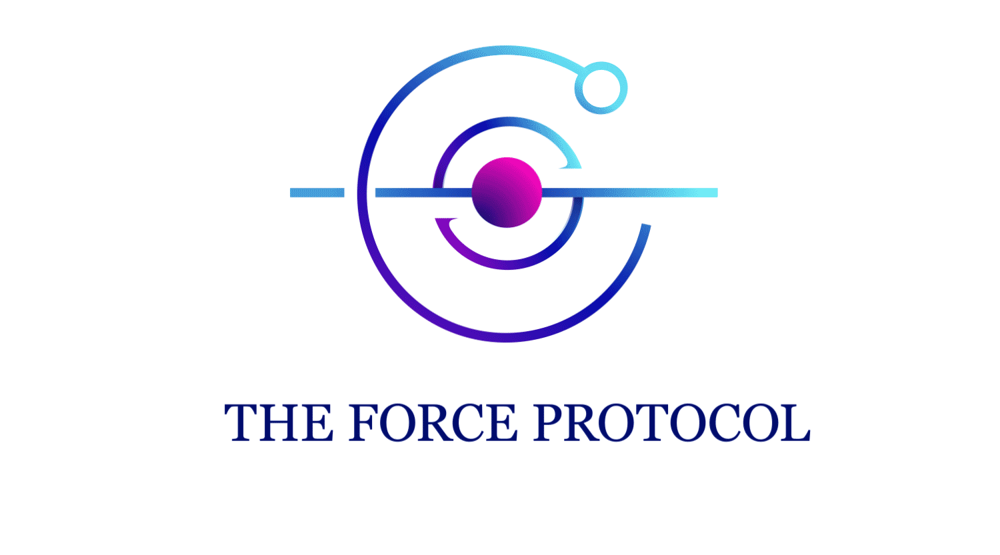
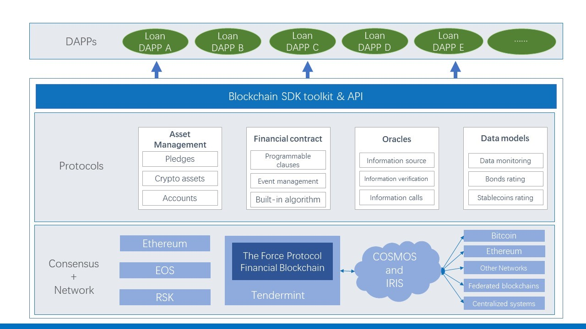
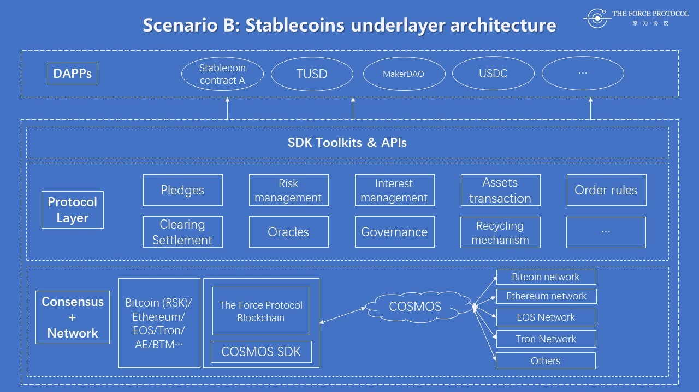

### The Force Protocol

    

## 原力协议概览

原力协议是分布式加密数字金融服务协议，基于主流公链和底层跨链协议，通过对分布式金融业务流程的抽象和封装，以SDK及API的形式，用一站式解决方案赋能去中心化金融应用开发。为跨平台资产流转、交易深度共享、跨链加密资产抵押的稳定币发行、通证债券 发行、链上支付、交易清结算等金融需求提供解决方案。

原力协议在分布式金融生态里搭建去中心化金融服务的通用开发平台，通过将分布式金融当中与具体场景相关的需求框架化、系统化，为分布式网络内的金融服务提供通信标准和开发框架，让加密资产可以在框架内实现安全、高效的价值互通。

当前，声称要做 Open Finance，构建去中心化金融生态体系的项目很多，部分项目选择先构建一个大而全的底层基础架构，再发展相应的链上服务。然而，软件开发模式对产品能否适应市场具有重要影响，由于人类对科技发展存在认知局限，所谓全面性的架构所开发出的产品往往会落后于时代发展，对用户造成使用上的不便，甚至被市场淘汰。因此，这种开发思路在原力协议团队看来是不合适的。我们选择了先基于具体的金融应用场景，将该场景以去中心化的方式实现，再通过抽象各业务环节，开发对应场景下通用协议所需要的相关模块，通过快速版本迭代，为搭建场景相关的应用提供开发套件和一系列可调用接口。这样一来， 保证了协议层所提供的功能不是闭门造车，而是符合现实应用的需求，且能推动相关领域的技术发展。

原力协议所支持的首个金融应用场景是去中心化借贷，在完成借贷场景相关开发的同时，将根据市场需求和技术发展，为更多金融场景（稳定币、通证债券、支付、清算等）提供解决方案。

- 场景一：基于跨链技术的去中心化借贷服务

选择借贷作为原力协议的首个应用场景，主要有两个原因。

首先，借贷现象在人类社会已有长久的历史，是经济活动中的基础需求，到了区块链网络中，对于加密数字资产的借贷需求也仍然存在。金融科技与互联网结合，催生了以 P2P 为代表的系列互联网金融服务。但是，随着互联网金融的发展，其固有的种种弊端正逐步开始产生影响。互联网金融业务的痛点包括：平台过度中心化，中心化的数据导致交易记录易被伪造，交易记录伪造导致平台随意挪动资金，P2P爆雷跑路频发，违约催收成本巨大，无抵押贷款导致巨额风控投入，风控严格也无法避免违约坏账，坏账底层资产难以变现，等等。随着去中心化金融技术的进步，以及人类社会物理资产向加密数字资产的转移大势，基于加密数字资产的借贷，由于其账本一致且不可篡改，底层抵押资产流动性好，无需催收成本等等优势， 将颠覆互联网金融产业，甚至改造传统的借贷模式。随着技术架构的不断完善，基于加密数字资产的借贷将迎来产业的爆发，因此我们选择该赛道进行布局。

其次，原力协议的创始团队是互联网金融出身，联合创始人Allen从事互金领域股权投资多年，对行业有着独到的理解、丰富的经验和深厚的行业资源沉淀。团队从开始接触区块链就意识到，区块链在解决传统金融问题上具备先天的优势，这项技术必将深刻影响传统金融行业，甚至改写大部分金融公司的战略布局。我们想，与其被动接受这项代表未来的新技术带来的冲击，不如主动出击去迎接，主动革自己的命。从 2017 年上旬到 2018 年年底，Allen 带领原力协议创始团队在 Crypto 领域横向生态项目方面投资项目 60 余个。围绕 Crypto World纵向“借贷”相关的细分领域，团队深入研究和探讨了区块链对于借贷行业的改变，并对区块链借贷项目的发展现状做了充分分析和布局投资。

团队以“代码即法律，隐私即自由，计算即权利”的主张，投资布局覆盖区块链借贷领域的完整 垂直生态——从数字货币借贷项目到区块链借贷项目，从借贷底层公链项目到实际落地的DAPP项目。先后分别投资了DCC（信用公链）、ETHLend（借贷应用）、LBA 等多个项目。 团队在研究和投资过程中发现，区块链技术可以更好地解决金融交易当中的信任问题，借贷行业将是区块链技术最早落地和最早有所作为的行业之一。但基于区块链和加密数字货币的借贷生态目前依然存在一块重要空缺：如何将借贷框架系统化、将 DAPP 的技术模块化、如何运用分布式的模式变革传统中心化的运营、如何对借贷底层交易模式和商业逻辑进行重构和升级。于是我们开始自己着手搭建去中心化金融协议，立足于现实问题，将去中心化借贷 作为原力协议的首个突破口。

全球已经有多个基于区块链网络的借贷 DAPP 面世，但是这些 DAPP 上的订单因无法实现共享，使得有限的借贷订单分布在多个平台中，供给端与需求端衔接不上，阻碍了借贷市场的进一步发展壮大。此外，仍然存在大量用户(如矿场主)的借贷需求得不到满足，而很多持有现金的用户缺乏安全有效的理财通道。

原力协议作为去中心化金融服务协议，在借贷这个场景下，跟市面上所有的借贷平台、中心化或去中心化的借贷 DAPP都不是竞争关系，而是竞合关系。原力协议可以敞开订单薄甚至是资金端给这些借贷平台，也只有这样，才能一起推动整个加密数字资产生态的逐步完善和活跃。基于原力协议的底层技术框架，做中心化借贷的项目方可以方便快速的搭建去中心化借贷系统。原力协议不仅可以支持借贷场景，基于未来去中心化金融业务发展，可以支持去中心化稳定币，债券发行，衍生品交易，支付，清结算等OpenFinance业务。

目前每个区块链应用都面临的问题是跨链交互，原力协议支持跨链资产互相操作，计划通过COSMOS 项目的 IBC 通信协议模块实现跨链交互，未来也将关注 Polkadot 项目的跨链技术。目前，原力协议在借贷场景的架构如下：

      

 
图一   原力协议借贷场景下的技术架构  V 1.0

- 场景二：多链加密资产质押的稳定币

在实现借贷场景的同时，由于稳定币的发行和应用与借贷业务有天然联系，基于对稳定币业务本质的理解，原力协议首次创新性的提出，基于多种跨链加密资产实现稳定币的抵押发行，为稳定币发行服务商提供开源框架，允许其自定义抵押资产种类、比例、治理机制，用市场竞争的思路选择最优化的跨链抵押资产组合；
在这种模式下，稳定币供应商根据自身的风险控制能力、资产偏好、选择借贷抵押资产，根据原力协议提供的开发框架，开发抵押、风控、平仓等合约，为持有不同公链资产的用户提供去中心化质押资产借稳定币的服务；

      

图二    原力协议基于稳定币市场的技术架构  V 1.0

经过市场竞争，在资产组合、风控、用户体验、治理方面最优秀的 DAPP 团队将会胜出，成为原力协议体系内的主要稳定币供应源之一，维护其发行稳定币的币值稳定。这一机制能够真正实现哈耶克在《货币的非国家化》一书中所提出的，私人货币发行和流通的经济体系，在人类历史上首次创造出一个全球共享、非国家化的自由货币市场。（哈耶克的原文中，私人银行通过信贷发行货币，并负责维持其货币对基础消费品的购买力。 不同的发行商通过维持币价稳定的竞争而占有市场。在此，则是维持去中心化借贷生成稳定 币的机制稳定，以及维持稳定币对加密资产的购买力。）

金融的核心是流动性，在传统金融体系里，很大比例的流动性来源于资产的质押，大量的信贷和资金支撑着经济的增长。原力协议要做的就是通过信贷和稳定币作为切入点，让已经存在的链上资产和将来要大量上链的资产，都能被用于质押借贷，生成流动性，进而打通支付、 跨境清算和结算等功能，而且链上产生的稳定币还能通过法币连接系统，被重新投入到实体经济，这样就打通了链上和链下的流动性，相互促进经济发展。

基于当前架构，原力协议将在最小可实现版本的基础上快速迭代，同时与 Open Finance 社区保持充分交流，逐步实现更多令人兴奋的链上金融功能。

原力协议的开发周期，从 2019 年 1 月起计算，预计 3 年完成对多种金融场景的开发支持。项目开发经费初步预计在 5000 万元人民币左右。因为项目初期支出较大，为了公司稳定经营考虑，团队于 2018 年开始逐步建立了围绕投资、挖矿和借贷的完整商业闭环。通过自持鄂尔多斯矿场、四川丰水电矿场获得矿机托管收入，一方面形成币币贷 APP 借贷需求端的天然用户池，另一方面也为借贷资金端入场找到了升值场景。同时，通过自持矿场/矿池的加密货币挖矿收益，以及团队在传统金融的法币投资收益，形成一个多方联动的循环圈，每个环节都可以互相依靠，既可以个人支撑也可以群体协作。这样可持续盈利的商业闭环，一方面，在早期阶段，支撑起了原力协议的开发需求。另一方面，这也是一个开放式的成长模型，利于围绕原力协议的金融生态圈成长壮大，并形成正向循环。

原力协议团队瞄准了加密数字资产领域下一个可以落地的赛道，我们希望能够和更多行业内的顶级伙伴合作，共同发力去中心化金融服务，一起推动这个行业的进步，参与人类历史的下一个伟大进程。

[了解更多](https://theforceprotocol.com/theforceprotocol_whitepaper.pdf)